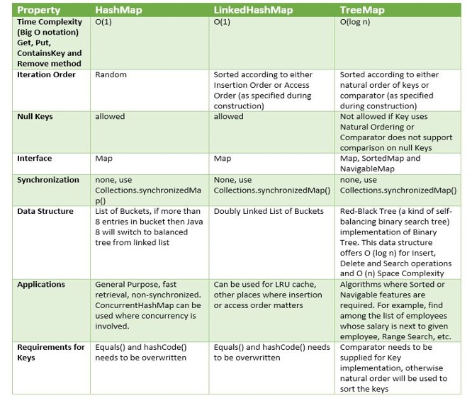

## Descrição de Collections

*  Collection é um objeto que agrupa múltiplos elementos (variáveis primitivas ou objetos) dentro de uma única unidade.
*  Serve para armazenar e processar coleções de dados de forma eficiente.
*  Antes do Java 2 (JDK 1.2), a implementação de coleções no Java incluía poucas classes e não tinha a orgganização de um framework.

## Composição das Collections

* **Interfaces:** É um contrato que quando assumido por uma classe deve ser implementado.
* **Implementações ou Classes:** São as materializações, a codificação das interfaces.
* **Algoritmos:** É uma sequência lógica, finita e definida de instruções que devem ser seguidas para resolver um problema.

## Hierarquia Collections

---

## java.util.List

* Elementos duplicados e garante ordem de inserção.
>ArrayList deve ser usado onde mais operações de pesquisa são necessarias e
>LinkedList deve ser usado onde mais operações de inserção e excusão são necessarias.

| **ArrayList** | **Linkedist** |
| ------------- | ------------- |
| This class uses a dynamic array to store the elements in it. With the introduction of [generics](https://www.geeksforgeeks.org/generics-in-java/), this class supports the storage of all types of objects. | This class uses a [doubly linked list](https://www.geeksforgeeks.org/doubly-linked-list/) to store the elements in it. Similar to the ArrayList, this class also supports the storage of all types of objects. |
| Manipulating ArrayList takes more time due to the internal implementation. Whenever we remove an element, internally, the array is traversed and the memory bits are shifted. | Manipulating LinkedList takes less time compared to ArrayList because, in a doubly-linked list, there is no concept of shifting the memory bits. The list is traversed and the reference link is changed. |
| This class implements a [List interface](https://www.geeksforgeeks.org/list-interface-java-examples/). Therefore, this acts as a list. | This class implements both the [List interface](https://www.geeksforgeeks.org/list-interface-java-examples/) and the [Deque interface](https://www.geeksforgeeks.org/deque-interface-java-example/). Therefore, it can act as a list and a deque. |
| This class works better when the application demands storing the data and accessing it. | This class works better when the application demands manipulation of the stored data. |

##### Tabela do site [geeksforgeeks](https://www.geeksforgeeks.org/arraylist-vs-linkedlist-java/)    

---

## java.util.Set

* Não permite elementos duplicados
* Não possui índice

##### Fonte: [KrishnaBankar](https://krishnabankar.medium.com/java-collection-framework-fdd34a2b6a62)

##### Fonte: [KrishnaBankar](https://krishnabankar.medium.com/java-collection-framework-fdd34a2b6a62)

##### Fonte: [KrishnaBankar](https://krishnabankar.medium.com/java-collection-framework-fdd34a2b6a62)

---

## java.util.Map

* Elementos únicos (key) para cada valor (value)

---

## java.util.Stream

### Reference Method
* #### Reference Method é um novo recurso do Java 8 que permite fazer referência a um método ou construtor de uma classe (de forma funcional) e assim indicar que ele deve ser utilizado num ponto específico do código, deixando-o mais simples e legível. Para utilizá-lo, basta informar uma classe ou referência seguida do simbolo "::" e o nome do método sem parênteses no final. Resumindo, serve para simplificar uma expressão Lambda.

### Streams API

* #### A Streams API traz uma nova opção para a manipulação de coleções em Java seguindo os princípios da programação funcional. Combinada com as expressões Lambda, ela proporciona uma forma diferente de lidar com conjuntos de elementos, oferecendo ao desenvolvedor uma maneira simples e concisa de escrever código que resulta em facilidade de manutenção e paralelização sem efeitos indesejados e tempos de execução.

### Classe Anônima

* #### A classe anônima em Java é uma classe que não recebeu um nome e é tatno declarado ou instanciado em uma única instrução. Você deve considerar o uso de uma classe anônima sempre que você precisa para criar uma classe que será instanciada apenas uma vez.

### Functional Inteface

* #### Qualquer interface com um SAM (Single Abstract Method) é uma interface e sua implementação pode ser tratada como expressão Lambda. São elas:
  * #### Comparator;
  * #### Consumer;
  * #### Function;
  * #### Predicate;

### Lambda
 
* #### Uma função Lambda é uma função sem declaração, isto é, não é necessário colocar um nome, um tipo de retorno, e o modificador de acesso. A ideia é que o método seja declarado no mesmo lugar em que será usado. As funções Lambda em Java tem sintaxe definida como (argumento) -> (corpo).

---

## Exercícios Propostos para conteúdo de List

### 1. Faça um programa que receba a temperatura média dos 6 primeiros meses do ano e armazene-as em uma lista. Após isto, calcule a média semestral das temperaturas e mostre todas as temperaturas acima desta média, e em que mês elas ocorreram (mostrar o mês por extenso: 1 - Janeiro. 2 - Fevereiro).

### 2. Utilizando listas, faça um programa que faça 5 perguntas para uma pessoa sobre um crime. As perguntas são:

  1. "Telefonou para a vítima?"
  2. "Esteve no local do crime?"
  3. "Mora perto da vítima?"
  4. "Devia para a vítima?"
  5. "Já trabalhou com a vítima?"

### Se a pessoa responder positivamente a 2 questões, ela deve ser considerada como "Suspeita", entre 3 e 4 como "Cúmplice" e 5 "Assassina". Caso contrário, ela será classificada como "Inocente".

---

## Exercícios Propostos para conteúdo de Set

### 1. Crie um conjunto contendo as cores do arco-iris e:

1. Exiba todas as cores, uma abaixo da outra;
2. A quantidade de cores que o arco-iris tem;
3. Exiba todas as cores em ordem alfabética;
4. Exiba as cores na ordem inversa da que foi informada;
5. Exiba todas as cores que começam com a letra "v";
6. Remova todas as cores que não começam com a letra "v";
7. Limpe o conjunto;
8. Confira se o conjunto está vazio.

### 2. Crie uma classe LinguagemFavorita que possua os atributos nome, anoDeCriacao e ide. Em seguida, crie um conjunto com 3 linguagens e faça um programa que ordene esse conjunto por:

1. Ordem de inserção;
2. Ordem Natural (nome);
3. IDE;
4. Ano de criação e nome;
5. nome, ano de criação e ide.

### Ao final, exiba as linguagens no console, uma abaixo da outra

---

## Exercícios propostos para conteúdo de Map

### 1. Dada a população estimada de alguns estados do NE brasileiro, faça:
* Estado PE - População = 9.616.621
* Estado AL - População = 3.351.543
* Estado CE - População = 9.187.103
* Estado RN - População = 3.534.265
### - Crie um dicionário e relacione os estados e suas populações;
### - Substitua a população do estado do RN por 3.354.165;
### - Confira se o estado PB esta no dicionário, caso não, adicione: PB - 4.039.277;
### - Exiba a população de PE;
### - Exiba todos os estados e suas populações na ordem que foi informado;
### - Exiba o estado e sua populações em ordem alfabética;
### - Exiba o estado com menor população e sua quantidade;
### - Exiba o estado com maior população e sua quantidade;
### - Exiba a soma da população desses estados;
### - Exiba a média da população deste dicionário de estados;
### - Remova os estados com população inferior a 4.000.000;
### - Apague o dicionário de estados;
### - Confira se o dicionário está vazio.

## 2. DESAFIO
* ### Faça um programa que simule o lançamento de dados.
### Lance o dado 100 vezes e armazene.   Depois, mostre quantas vezes cada valor foi inserido.

### **Para saber mais**
### Exemplos de Ordenação:
1. ### Key(Objeto) + value(Set Objeto);
2. ### Key(Objeto) + value(Objeto);